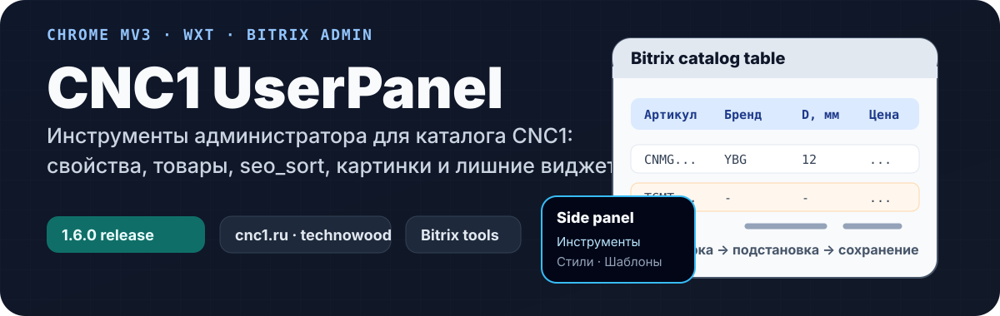

<p align="center">
  
</p>

# CNC1 UserPanel

Расширение для Chrome/Edge/Firefox, которое добавляет рабочие инструменты поверх страниц CNC1 и Bitrix. Оно помогает быстрее проверять каталог, массово редактировать товары, переносить наборы свойств и убирать интерфейсный шум во время администрирования.

## Что даёт

| Задача | Что делает расширение |
| --- | --- |
| Заполнить свойства раздела | Берёт названия колонок из шапки таблицы каталога и по кнопке подставляет найденные совпадения в пустые строки свойств Bitrix. |
| Повторять наборы свойств | Сохраняет шаблоны свойств, вставляет их в другой раздел, поддерживает импорт и экспорт JSON. |
| Массово править товары | Работает по выбранным строкам или кодам товаров, умеет заменить, добавить, удалить или очистить значения multi-value полей. |
| Найти пустые характеристики | Подсвечивает пустые ячейки в таблице каталога и даёт навигацию по пропускам. Панель можно перетаскивать и сворачивать. |
| Проверить `seo_sort` | Показывает значения сортировки, дубли, пропуски, смены диапазона, выбросы и нарушения порядка. |
| Проверить изображения | Показывает размеры Full/Site изображений и вес файла при наведении. |
| Убрать лишние виджеты | Отдельными переключателями скрывает соцвиджеты, CRM-кнопки, ИИ-чат CNC1, кнопки связи и Involveo. |

## Где работает

Расширение подключается к страницам:

- `https://cnc1.ru/*`
- `https://www.cnc1.ru/*`
- `https://xn--80akihldccewegghem.xn--p1ai/*`
- `https://technowood.ru/*`

## Быстрая установка из Release

1. Откройте [последний Release](https://github.com/klip5a/user-script-panel-extension/releases).
2. Скачайте ZIP-архив расширения.
3. Распакуйте архив в отдельную папку.
4. В Chrome откройте `chrome://extensions` или в Edge `edge://extensions`.
5. Включите `Режим разработчика`.
6. Нажмите `Загрузить распакованное расширение`.
7. Выберите распакованную папку расширения.

Если нужна авторизация на CNC1, войдите на сайт в том же профиле браузера.

## Как пользоваться

Откройте сайт CNC1 или страницу Bitrix в поддерживаемом домене. Расширение применит включённые инструменты к текущей странице, а настройки доступны через side panel.

Ключевые переключатели:

- **Инструменты** — проверки и помощники для рабочих страниц: `seo_sort`, фильтры, картинки, пустые свойства.
- **Стили** — скрытие внешних виджетов и мешающих элементов. Секция сворачивается, чтобы не занимать место.
- **Шаблоны свойств** — импорт и экспорт сохранённых наборов свойств.

## Основные сценарии

### Подставить свойства из шапки таблицы

1. Откройте страницу раздела с таблицей каталога.
2. Дождитесь загрузки расширения: оно запомнит колонки между `Артикул` и `Цена`.
3. Откройте редактирование свойств раздела.
4. Нажмите `Подставить из шапки`.
5. Проверьте итог: расширение покажет, что добавилось, а что не добавилось и почему.

Сравнение выполняется по точному названию свойства. Сокращения и синонимы не угадываются специально.

### Заполнить товары массово

1. Откройте список товаров в режиме редактирования.
2. Выберите строки или вставьте коды товаров.
3. Отметьте нужные свойства и режим изменения.
4. Нажмите применение и сохраните результат штатными средствами Bitrix.

Расширение подставляет значения в форму, но финальное сохранение остаётся за Bitrix.

### Проверить каталог

- Пустые характеристики подсвечиваются прямо в таблице.
- Мини-панель навигации показывает количество пропусков и помогает переходить между ними.
- `seo_sort` отображается рядом с товарами и подсвечивает подозрительные последовательности.
- Бейджи изображений показывают размеры и помогают быстро заметить расхождения Full/Site.

## Разработка

Стек:

- TypeScript
- Preact
- WXT
- Vite
- Tailwind CSS

Установка зависимостей:

```bash
pnpm install
```

Запуск для Chrome/Edge:

```bash
pnpm run dev
```

Подключите папку:

```text
.output/cnc1-admin-extension/chrome-mv3-dev
```

Запуск для Firefox:

```bash
pnpm run dev:firefox
```

Во Firefox откройте `about:debugging#/runtime/this-firefox` и выберите `manifest.json` из:

```text
.output/cnc1-admin-extension/firefox-mv3-dev
```

## Сборка

Production-сборка:

```bash
pnpm run build
```

ZIP для публикации:

```bash
pnpm run zip
```

Проверка типов:

```bash
pnpm run typecheck
```

## Структура

```text
entrypoints/        Точки входа расширения: content script, popup, side panel
src/features/       Инструменты для страниц CNC1/Bitrix
src/settings/       Настройки расширения и chrome.storage
src/runtime/        Применение настроек на странице
public/icon/        Иконки расширения
```

## Версия

Текущая версия: `1.6.0`.

Версия указывается в `package.json` и `wxt.config.ts`.
